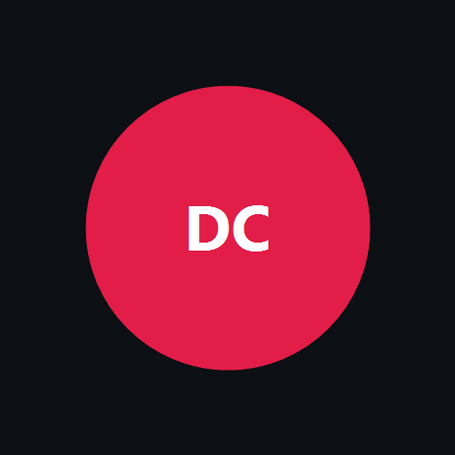

<p align="center">
  
</p>

<h1 align="center">rio-go-clon-front</h1>

<p align="center"><strong>Genesis storefront · Dulce Clic</strong> — una sola app web; el resto de tiendas la embebe por <code>iframe</code> + <code>?conn=</code>.</p>

[](https://jeff-aporta.github.io/rio-go-clon-front/)
[](https://react.dev/)
[](https://www.typescriptlang.org/)

## Idea

| Pieza | Rol |
|-------|-----|
| **Este front (genesis)** | UI única publicada en GitHub Pages |
| **Worker** | Todas las apps; `X-App-Id` / `appId` elige schema Neon + brand |
| **Otras apps / sites** | Solo un `<iframe src="…?conn=…&embed=1">` — sin fork del front |

Hoy solo existe **`riogo`**. Nuevas tiendas = entrada en `api/src/apps.ts` + schema BD; el iframe apunta al mismo genesis con otro `appId`.

## Demo

**https://jeff-aporta.github.io/rio-go-clon-front/** — sin `conn` → directorio de apps  
Con `conn` → tienda.

API: [rio-go-clon.jeffaporta.workers.dev](https://rio-go-clon.jeffaporta.workers.dev) · back: [`rio-go-clon-back`](https://github.com/Jeff-Aporta/rio-go-clon-back) (privado)

## Embed (otras apps)

```html
<iframe
  title="Pedidos"
  src="https://jeff-aporta.github.io/rio-go-clon-front/?conn=CONN_B64URL&embed=1"
  style="width:100%;height:100dvh;border:0"
  allow="clipboard-write"
></iframe>
```

`conn` = base64url de:

```json
{
  "apiBase": "https://rio-go-clon.jeffaporta.workers.dev",
  "appId": "riogo"
}
```

Ejemplo (riogo):

```text
https://jeff-aporta.github.io/rio-go-clon-front/?conn=eyJhcGlCYXNlIjoiaHR0cHM6Ly9yaW8tZ28tY2xvbi5qZWZmYXBvcnRhLndvcmtlcnMuZGV2IiwiYXBwSWQiOiJyaW9nbyIsInN0b3JhZ2VQcmVmaXgiOiJyaW9nbyJ9&embed=1
```

`embed=1` oculta el hub y el pie del genesis (chrome del host).

## Config genesis

`config.json` — solo el worker por defecto:

```json
{
  "apiBase": "https://rio-go-clon.jeffaporta.workers.dev"
}
```

## Qué incluye el genesis

- Catálogo, carrito, WhatsApp, seguimiento (`?s=`)
- Admin (`?v=adm`)
- Tema + marca desde `/api/brand` (por `appId`)
- Hub sin `?conn=` → `GET /api/apps`

## Desarrollo

```bash
npm ci
npm test          # guardrails (bg2font, CSS, storage) — ver ../docs/LLM.md
npm run build:check
```

Push a `main` → GitHub Pages publica `_dist`.

Reglas para agentes: [`docs/LLM.md`](../docs/LLM.md).

## Stack

React 18 · TypeScript · esbuild · Web Awesome · Iconify · GitHub Pages
